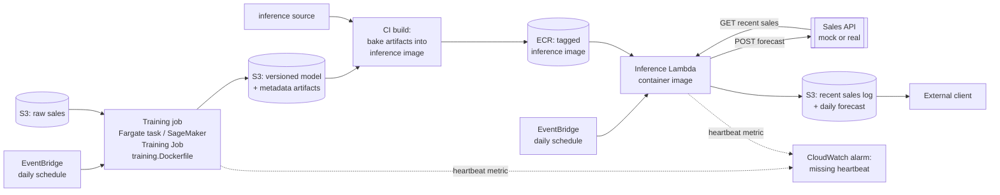

# Architecture

Solution design for `docs/task.md:16-24` (deliverable 2): predictions computed once a day,
queryable by external clients at low latency, running autonomously. See `docs/what_if.md` for
what changes as load, model size, or query patterns outgrow this shape.

This is the target AWS design the images in this repo (`docker/*.Dockerfile`, `docker-compose.yml`)
are built to run under. **Only the local pieces are actually built**: the three container images
and the Compose stack that wires them together for a laptop/CI smoke test
(`scripts/compose_smoke.sh`, `make test-compose`). Everything to the right of "CI builds and tags
the inference image" below — the AWS services, the schedule, the read path — is proposed, not
deployed; `Makefile:109-119` stubs `deploy-staging`/`deploy-prod`/`deploy-dev` on purpose, so the
CD pipeline shape exists without pretending real infra is behind it yet.

The CI half of that split is real, not a stub: `.github/workflows/ci-cd.yml` is a reusable
workflow (lint → unit tests → e2e tests → `make test-compose`) called on every push/PR, so the gap
is specifically build/deploy automation, not tests/lint — those already gate every change.

## Repository layout

```
src/
  infra/        config loader, logger, correlation-id context
  forecasting/  domain kernel: consts, metadata contract, preprocessing, feature engineering, model load+predict
  training/     trains the model, writes outputs/{model,metadata,predictions}
  inference/    loads the model, calls the source/result HTTP endpoints, serves next-day forecasts
  testkit/      e2e test helpers (script runner, tolerance asserts) — dev-only
docker/         one Dockerfile per image (inference, training, mock-api) + the mock API's source
deploy/         config/*.toml baked into each image at build time (absolute paths, no uv.lock at runtime)
docker-compose.yml   local stack: mock-api -> training -> inference, wired together for an e2e run
```

Dependency direction: `training` and `inference` (deployable apps) both depend on `forecasting`,
which depends on `infra`; `testkit` is a dev dependency of both apps. Neither `training` nor
`inference` depends on the other.

## Diagram



## Two schedules, two compute shapes

The split is by **workload**, not by platform:

- **Training** (`docker/training.Dockerfile`) → a Fargate task or a SageMaker Training Job, not
  Lambda. Lambda's 15-minute execution cap and 10 GB image/`/tmp` ceiling are fine against today's
  ~20k-row CSV but do not generalise, and Lambda has no GPU path if the model ever needs one.
  Training reads raw sales from S3, writes a versioned model (`xgb_daily_product_demand.json`) and
  metadata (`forecast_metadata.joblib`) back to S3 — the same two artifacts
  `training/main.py` already writes to `outputs/` locally.
- **Daily inference batch** → a Lambda container image. The whole run is seconds of compute
  against a 2.5 MB model; at once-a-day cadence every invocation is a cold start anyway, so
  Lambda's cold-start tax buys nothing to optimize away, and the platform's low ceiling (same
  15-minute/10 GB limits) is never in play at this size.

Both are the *same* container contract already proven by `docker-compose.yml` and
`scripts/compose_smoke.sh`: `training` service writes into a shared volume, `inference` service
reads it back. Swapping the image runner from "Docker Compose on a laptop" to "Fargate task" /
"Lambda container image" changes the trigger and the artifact source, not the code inside the
image.

## Why Fargate/SageMaker + Lambda, not Databricks

Databricks is the closest managed alternative to the whole pipeline above: native MLflow (tracking
+ registry), Jobs run-status alerting (email/webhook on failure/success/duration threshold) with no
separate metrics system to build, and a notebook-to-production story that would have matched this
project's original Jupyter-notebook shape directly.

Declined for this design, not overlooked:

- **The container-first path is already built and proven.** `docker/*.Dockerfile` and
  `docker-compose.yml` run the real training→inference pipeline end to end today
  (`scripts/compose_smoke.sh`, `make test-compose`). Databricks Jobs run on managed clusters against
  a cluster spec, not arbitrary containers — Databricks Container Services only lets you customize
  the cluster's *base image*, it doesn't take the plain `ENTRYPOINT` + config-file/env-var contract
  these images already use. Adopting Databricks now would mean re-deriving the training/inference
  split for its container model instead of reusing what already works — the same "not a free lunch"
  bar `docs/what_if.md` #1 applies to SageMaker Processing/Training Jobs.
- **Cost and operational shape.** Databricks bills for cluster runtime (sized clusters, even for a
  short job) vs. Lambda's per-invocation billing and Fargate's per-task-second billing — cheaper at
  this job's actual size (one ~20k-row CSV, seconds of inference compute, once a day), with no
  workspace/cluster fleet to keep provisioned.
- **What's given up by not going Databricks:** native MLflow registry — already a named,
  declined-for-now upgrade in `docs/what_if.md` #4 for the same YAGNI reasoning — and Jobs
  run-status alerting, which the CloudWatch heartbeat alarm below covers for the same "job silently
  stopped" failure mode without needing a Databricks workspace to run it in.

Revisit if model retraining ever needs coordinating across multiple contributors, or if
notebook-based experimentation becomes a real day-to-day workflow again — that's the workflow
Databricks earns its keep on, not running a single scheduled batch job.

## Model-loading strategy per platform

(`docs/TODO.md:60`, "Model loading strategy per platform".) The image build already treats the
model directory as a config value, not a hardcoded path: `inference/config.py:11` declares
`artifact_dir: Path`, and both `forecasting/artifacts.py:9`
(`verify_artifacts_present`) and `forecasting/model.py:17-18` (`load_model`) take it as a
parameter rather than assuming a location. `infra/config.py:16-30`'s `load_config` overrides any
config field from an env var (`<PREFIX>_<FIELD>`, e.g. `INFERENCE_ARTIFACT_DIR`), so "where the
model lives" is already a one-env-var decision, not a code change.

Two strategies fall out of that one field:

- **Baked into the image** (what `docker/inference.Dockerfile:36-40` does today: `COPY
  ${MODEL_DIR}/xgb_daily_product_demand.json ${MODEL_DIR}/forecast_metadata.joblib /opt/model/` as
  the deliberately-last layer, so only a model change busts that layer's cache). This is the
  Lambda path: no startup fetch, no dependency on S3 being reachable or the training job having
  finished before the schedule fires, and the image tag *is* the deployable unit — pull an older
  tag, get an older model, with no separate "which model version is live" bookkeeping.
- **Mounted or fetched at start** — point `artifact_dir` (`INFERENCE_ARTIFACT_DIR`) at a mounted
  volume or have the entrypoint pull from S3 before `verify_artifacts_present` runs. Nothing in
  `forecasting` needs to change; this is a deploy-time config choice, not a code fork. This is the
  shape you reach for once baking stops making sense — see `docs/what_if.md` #3.

### Why baked, not fetched, for the default path

At daily cadence, cold starts are the normal case, not an edge case — there is no warm pool to
keep hot for a once-a-day invocation. Baking means the image *is* self-contained: no network call
on the critical path, no "S3 was slow/unreachable, fail the whole day's forecast" failure mode, and
the container fails at `docker build` time (missing artifact) rather than at invocation time. The
cost is releases coupling model and code together — accepted deliberately here because a daily
batch job has no user-facing deploy-window pressure; see `docs/what_if.md` #3 for when that cost
stops being acceptable.

### Rollback

(`docs/TODO.md:67`, "Rollback mechanism if newly deployed model performs badly".) Rollback is
redeploying the previous image tag. Because the model is baked in, "roll back the
model" and "roll back the code" are the same action — point the Lambda's container image at the
prior ECR tag. There is no separate model-registry rollback to coordinate, which is the trade for
accepting the coupling above.

### Caveat: image reproducibility is not model reproducibility

An image tag reproducibly gets you back the same *bytes* — the same JSON model dump, the same
metadata file. It does not mean rebuilding from the same commit reproduces those bytes: training
has no seed pinning yet (`docs/TODO.md:51`, "Seed pinning for training reproducibility"), so two
`make image-inference` runs off the same commit can bake in two different models. Treat the image
tag as the unit of rollback (it pins exact bytes), not the git commit (it doesn't).

## Predictions store and the low-latency read path

Inference writes each day's forecast, plus the recent-sales window it pulled from the sales API,
to S3 as JSON/CSV under a dated key — the same artifact already produced locally as
`outputs/inference_next_day_forecast.csv` via `src/inference/inference/gateway.py`'s
`upload_inference_results` (currently a POST to a sales API, mock or real), just added as a second
sink. Persisting the recent-sales window alongside the forecast also covers `docs/TODO.md`'s
"persist inference input data ... for future ground-truth join" item for free — it's the same S3
write, not a separate mechanism.

`docs/task.md:21` requires external clients to query predictions "at any time with low latency."
A direct read of a well-known/dated S3 key clears that bar at the request volume this system
actually has (a handful of clients, one new object a day): GET latency is tens of milliseconds,
no compute sits on the read path, and there's no service to keep warm or pay for idly. Access is a
public-read bucket policy, justified by the data being non-PII aggregate sales figures
(`docs/planning.md`: "no compliance/retention concern"); a presigned-URL scheme is the fallback if
public-read is rejected later, without anything upstream changing.

The earlier open question of a latency SLA (`docs/TODO.md:65`) splits into two separate things
once stated precisely, and both are already covered:

- **Query latency** — how long a client's GET takes — is S3's own published object-retrieval
  performance, not something this app's code affects or needs to instrument separately.
- **Freshness** — how soon after the daily trigger the forecast is actually available to query —
  is exactly `inference_duration_seconds`, the metric `MetricsCollector` already records on every
  run (see Alerting, above). A CloudWatch alarm on that metric exceeding an agreed threshold (e.g.
  "not ready within N minutes of the EventBridge trigger") *is* the SLA-breach alert, using the same
  alarm mechanism as the heartbeat and drift checks — not a separate monitoring path to build.

This deliberately does *not* give clients filtered/indexed/paginated queries, per-client auth, or
protection against write concurrency — a DynamoDB table behind a read Lambda and API Gateway would,
at the cost of a running query tier this system doesn't need at today's scale. See
`docs/what_if.md` #2 for that escalation and its trigger.

## Failure signal: heartbeat, not just bad values

Both scheduled jobs already emit this without any AWS-specific code: `infra/metrics.py`'s
`MetricsCollector` sends a metrics batch — always including `total_duration_seconds` and
`correlation_id` — on every run via its `__exit__`, whether or not the run recorded anything else
(`src/training/training/main.py:235`, `src/inference/inference/main.py:99`). In AWS, the
`MetricsSink` behind it is a CloudWatch implementation instead of today's `LoggingMetricsSink`
(same `send(metrics)` interface, no caller change), and a CloudWatch alarm fires on that
`total_duration_seconds` metric going *missing* within the expected window — which is what catches
a job that silently stopped firing at all. A bad prediction still emits this heartbeat and passes
the check, but a job EventBridge never triggered, or that crashed before completion, does not
(`docs/planning.md:91`). This is deliberately a liveness check, not a quality check — see below for
where drift/quality monitoring sits alongside it.

## Drift and data-quality monitoring

Scope, per `docs/planning.md`: there's no ground-truth/label feedback loop in this assignment, so
monitoring is limited to data/feature drift, not model performance metrics — that would need
predictions joined against actuals, which persisting the recent-sales window to S3 (above) sets up
for later but doesn't provide today.

This reuses the same metrics seam as the heartbeat above, not a new subsystem — drift signals are
just more values recorded on the same `MetricsCollector` and sent through the same `MetricsSink`:

- **Categorical drift.** `src/inference/inference/preprocess.py:46` already filters incoming rows
  to `metadata.categories`; a sales row for a category the model wasn't trained on is silently
  dropped rather than counted. Recording that drop count (`metrics.record("unknown_category_rows",
  ...)`) before the filter turns a silent data-loss path into a monitored one, alerted on via the
  same CloudWatch-alarm mechanism as the heartbeat — not a new alerting path. (`docs/TODO.md`'s
  "Categorical feature drift" item is still open in code; this is its design.)
- **Numeric/distribution drift.** Training already computes per-category outlier bounds
  (`ForecastMetadata.outlier_bounds`, IQR quartiles used to mask outliers before fit). Comparing
  each day's incoming sales against those same bounds at inference time and recording the violation
  rate reuses a number training already produces instead of inventing a second drift statistic.
- **Missing/fabricated history.** `docs/TODO.md` already frames the 28-day contiguity gap (today's
  check only bounds the pooled min/max date span, not per-category contiguity, so a category closed
  for several days mid-window gets zero-filled and passes) as a data-drift guardrail in its own
  right, not a quick off-by-one fix — same family as the two checks above: reject or flag
  fabricated-looking input before it reaches the model, rather than waiting for a bad prediction.

**Declined: automatic retraining on detected drift.** `docs/planning.md` already rejects this in
favor of monitoring plus a human decision — an unattended pipeline that retrains itself off a drift
signal it can't tell apart from a genuine, permanent shift (a product line actually discontinued)
risks quietly baking a real business change into "corrected" data, or masking an upstream sales-API
bug as noise. These metrics feed a human here, not a retrain trigger.

## Alerting

One mechanism serves both the heartbeat and the drift metrics above: a CloudWatch Alarm per metric
(missing-data alarm on `total_duration_seconds` for the heartbeat, threshold alarms on
`unknown_category_rows` / `outlier_bound_violation_rate` for drift), each wired to an SNS topic that
fans out to email/Slack webhook subscribers. Nothing upstream of the alarm needs to know this exists
— it's a CloudWatch resource watching whatever `MetricsSink` already sends, not a code path.

**Databricks Jobs run-status alerting** — moot rather than declined: it's a property of running the
job *on* Databricks Jobs, and `docs/architecture.md`'s "Why Fargate/SageMaker + Lambda, not
Databricks" section already declined that platform for reasons unrelated to alerting (container
contract mismatch, cost/operational shape). Naming it here for completeness: had Databricks been
chosen, Jobs' built-in run-status alerting would have covered the heartbeat case without a
CloudWatch alarm — one more thing given up alongside native MLflow in that earlier decision, not an
independent tradeoff.

**Considered, declined: self-hosted Prometheus.** Prometheus's model is pull-based scraping of a
long-lived `/metrics` endpoint — a poor fit for Lambda/Fargate scheduled batch jobs that run for
seconds once a day and then don't exist to be scraped. Making it work would mean routing through a
Prometheus Pushgateway (or an OTel collector) as a translation shim, standing up and operating a
Prometheus server (storage, retention, HA) to receive metrics CloudWatch already accepts natively
via push (`PutMetricData`) with no extra infrastructure. Not worth it at this scale, and not a
service this design's already-declined managed-platform reasoning (Databricks, SageMaker Registry)
would suddenly favor self-hosting over.

**Compatible, optional: Grafana as a dashboard layer.** This isn't an either/or with CloudWatch —
Grafana's CloudWatch data source can query the same alarms/metrics for a more customizable dashboard
than the CloudWatch console, without replacing CloudWatch Alarms as the thing that actually pages
someone. Worth adding if the CloudWatch console's dashboards stop being enough; not needed to make
alerting work.

## Feature store

A feature store (SageMaker Feature Store, managed; [Feast](https://feast.dev), open-source) solves
a specific set of problems, none of which this project currently has:

- **Train/serve skew** — training and inference computing features differently and quietly
  disagreeing. Already solved here without one: `forecasting` is the single shared implementation
  both `training` and `inference` call (`forecasting.features.build_future_features`/
  `encode_for_model`, `forecasting.model.make_forecast`), not two independent copies a feature
  store would otherwise be reconciling.
- **Low-latency online feature retrieval** for serving a model on the request path. Doesn't apply
  to a once-a-day batch job — there's no "fetch this entity's latest features in under 10ms" case
  to serve. This only becomes relevant alongside `docs/what_if.md` #5 (per-request predictions), if
  that's ever taken.
- **Feature reuse and discovery across multiple models or teams.** There's one model, one owner,
  and one feature set — nothing to reuse *from* or discover.
- **Point-in-time-correct historical feature values** for building training sets that don't leak
  future information. Training rebuilds features fresh from the raw CSV each run rather than
  joining against a historical feature log, so this doesn't apply yet either.

The `forecasting` library already is the thing a feature store would otherwise need to exist to
prevent — a second, drifted copy of feature logic. Revisit if a second model gets added that wants
to share features with this one, or if per-request serving (`docs/what_if.md` #5) makes online
retrieval latency an actual requirement; neither is true today.

## Secrets

The sales API token is already read from the environment at call time
(`src/inference/inference/gateway.py`'s `_EnvSecretsProvider`, backed by `INFERENCE_API_TOKEN`;
Compose exercises the same mechanism with a literal `local-dev-token` in `docker-compose.yml:29`).
In AWS the only change is where that env var's value comes from — Secrets Manager injected into
the Lambda's environment at invoke time rather than a Compose-level literal — not the code that
reads it.
