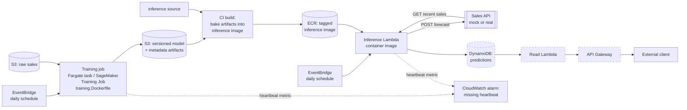

# Architecture

Solution design for `docs/task.md:16-24` (deliverable 2): predictions computed once a day,
queryable by external clients at low latency, running autonomously. See `docs/what_if.md` for
what changes as load, model size, or query patterns outgrow this shape.

This is the target AWS design the images in this repo (`docker/*.Dockerfile`, `docker-compose.yml`)
are built to run under. **Only the local pieces are actually built**: the three container images
and the Compose stack that wires them together for a laptop/CI smoke test
(`scripts/compose_smoke.sh`, `make test-compose`). Everything to the right of "CI builds and tags
the inference image" below — the AWS services, the schedule, the read path — is proposed, not
deployed; `Makefile:109-119` stubs `deploy-staging`/`deploy-prod`/`deploy-dev` on purpose, so the
CD pipeline shape exists without pretending real infra is behind it yet.

## Diagram

Dashed nodes (`DynamoDB`, the read `Lambda`, `API Gateway`) are the **designed-not-built** low-
latency query path — see below.

## Two schedules, two compute shapes

The split is by **workload**, not by platform:

- **Training** (`docker/training.Dockerfile`) → a Fargate task or a SageMaker Training Job, not
  Lambda. Lambda's 15-minute execution cap and 10 GB image/`/tmp` ceiling are fine against today's
  ~20k-row CSV but do not generalise, and Lambda has no GPU path if the model ever needs one.
  Training reads raw sales from S3, writes a versioned model (`xgb_daily_product_demand.json`) and
  metadata (`forecast_metadata.joblib`) back to S3 — the same two artifacts
  `training/main.py` already writes to `outputs/` locally.
- **Daily inference batch** → a Lambda container image. The whole run is seconds of compute
  against a 2.5 MB model; at once-a-day cadence every invocation is a cold start anyway, so
  Lambda's cold-start tax buys nothing to optimize away, and the platform's low ceiling (same
  15-minute/10 GB limits) is never in play at this size.

Both are the *same* container contract already proven by `docker-compose.yml` and
`scripts/compose_smoke.sh`: `training` service writes into a shared volume, `inference` service
reads it back. Swapping the image runner from "Docker Compose on a laptop" to "Fargate task" /
"Lambda container image" changes the trigger and the artifact source, not the code inside the
image.

## Model-loading strategy per platform

(`docs/TODO.md:60`, "Model loading strategy per platform".) The image build already treats the
model directory as a config value, not a hardcoded path: `inference/config.py:11` declares
`artifact_dir: Path`, and both `forecasting/artifacts.py:9`
(`verify_artifacts_present`) and `forecasting/model.py:17-18` (`load_model`) take it as a
parameter rather than assuming a location. `infra/config.py:16-30`'s `load_config` overrides any
config field from an env var (`<PREFIX>_<FIELD>`, e.g. `INFERENCE_ARTIFACT_DIR`), so "where the
model lives" is already a one-env-var decision, not a code change.

Two strategies fall out of that one field:

- **Baked into the image** (what `docker/inference.Dockerfile:36-40` does today: `COPY
  ${MODEL_DIR}/xgb_daily_product_demand.json ${MODEL_DIR}/forecast_metadata.joblib /opt/model/` as
  the deliberately-last layer, so only a model change busts that layer's cache). This is the
  Lambda path: no startup fetch, no dependency on S3 being reachable or the training job having
  finished before the schedule fires, and the image tag *is* the deployable unit — pull an older
  tag, get an older model, with no separate "which model version is live" bookkeeping.
- **Mounted or fetched at start** — point `artifact_dir` (`INFERENCE_ARTIFACT_DIR`) at a mounted
  volume or have the entrypoint pull from S3 before `verify_artifacts_present` runs. Nothing in
  `forecasting` needs to change; this is a deploy-time config choice, not a code fork. This is the
  shape you reach for once baking stops making sense — see `docs/what_if.md` #2.

### Why baked, not fetched, for the default path

At daily cadence, cold starts are the normal case, not an edge case — there is no warm pool to
keep hot for a once-a-day invocation. Baking means the image *is* self-contained: no network call
on the critical path, no "S3 was slow/unreachable, fail the whole day's forecast" failure mode, and
the container fails at `docker build` time (missing artifact) rather than at invocation time. The
cost is releases coupling model and code together — accepted deliberately here because a daily
batch job has no user-facing deploy-window pressure; see `docs/what_if.md` #2 for when that cost
stops being acceptable.

### Rollback

(`docs/TODO.md:67`, "Rollback mechanism if newly deployed model performs badly".) Rollback is
redeploying the previous image tag. Because the model is baked in, "roll back the
model" and "roll back the code" are the same action — point the Lambda's container image at the
prior ECR tag. There is no separate model-registry rollback to coordinate, which is the trade for
accepting the coupling above.

### Caveat: image reproducibility is not model reproducibility

An image tag reproducibly gets you back the same *bytes* — the same JSON model dump, the same
metadata file. It does not mean rebuilding from the same commit reproduces those bytes: training
has no seed pinning yet (`docs/TODO.md:51`, "Seed pinning for training reproducibility"), so two
`make image-inference` runs off the same commit can bake in two different models. Treat the image
tag as the unit of rollback (it pins exact bytes), not the git commit (it doesn't).

## Predictions store and the low-latency read path

Inference writes each day's forecast to DynamoDB, keyed by category/date, so a read is a
point/range lookup rather than a scan. **This half of the diagram — DynamoDB, the read Lambda,
API Gateway — is designed, not built.** `docs/task.md:21` requires external clients to query
predictions "at any time with low latency"; nothing in this repo implements that query path today
(inference only writes `outputs/inference_next_day_forecast.csv` via
`src/inference/inference/gateway.py`'s `upload_inference_results`, itself a POST to a sales API,
mock or real). `docs/TODO.md:65` already flags the resulting gap explicitly: no latency SLA or
perf monitoring is defined for that read path, because it doesn't exist yet to monitor.

## Failure signal: heartbeat, not just bad values

Both scheduled jobs (training, inference) emit a CloudWatch heartbeat metric on completion; a
CloudWatch alarm fires on a *missing* metric within the expected window, which is what catches a
job that silently stopped firing at all — a bad prediction still emits a heartbeat and passes this
check, but a job EventBridge never triggered, or that crashed before completion, does not
(`docs/planning.md:91`). This is deliberately a liveness check, not a quality check; see
`docs/what_if.md` and `docs/TODO.md:61` for where drift/quality monitoring would sit alongside it.

## Secrets

The sales API token is already read from the environment at call time
(`src/inference/inference/gateway.py`'s `_EnvSecretsProvider`, backed by `INFERENCE_API_TOKEN`;
Compose exercises the same mechanism with a literal `local-dev-token` in `docker-compose.yml:29`).
In AWS the only change is where that env var's value comes from — Secrets Manager injected into
the Lambda's environment at invoke time rather than a Compose-level literal — not the code that
reads it.
