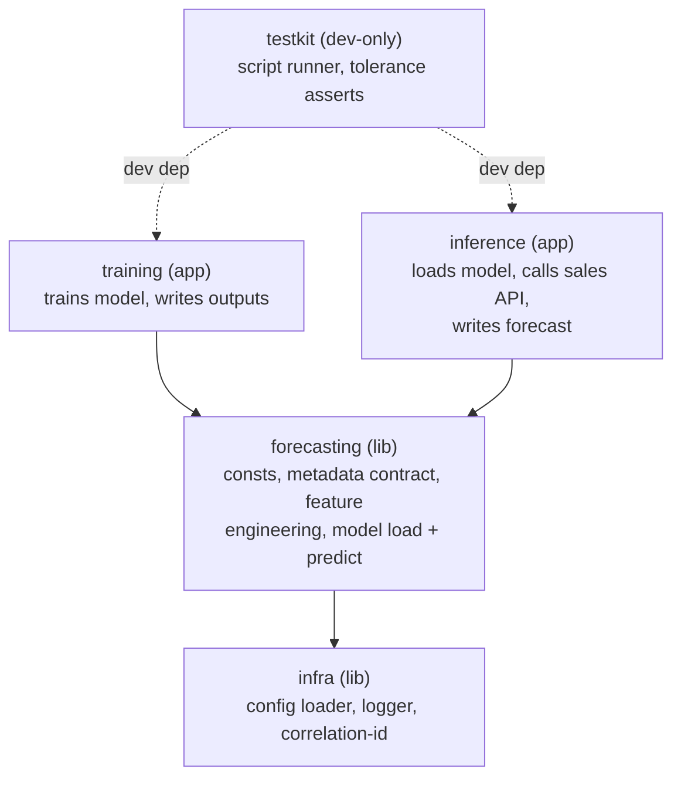

# Architecture (current)

What's actually built and running today: two container images and the Compose stack
that wires them together for a laptop/CI smoke test. For the proposed AWS target this
is built to run under, see `docs/deployment.md`. For what changes if requirements
evolve, see `docs/what_if.md`.

## Repository layout

`training` and `inference` never depend on each other — the only link between them is
the artifact files on disk. `docker/` holds one Dockerfile per image (inference,
training, mock-api) plus the mock API's source; `deploy/config/*.toml` holds the config
baked into each image at build time; `docker-compose.yml` wires mock-api → training →
inference together for a local run.

## Local pipeline

`docker-compose.yml` runs `mock-api` → `training` → `inference`, handing artifacts off
through a shared volume. Key commands (`make` with no arguments lists all of them):

- `make images` — build all three images
- `make compose-up` / `make compose-down` — run/tear down the local stack
- `make compose-retrain` — rerun training alone without restarting the rest
- `make test-compose` — run the full pipeline and diff the result against the inference
  baseline (also a CI job)
- `make baseline-inference` — regenerate that baseline after an intentional model change

`make deploy-staging` / `deploy-prod` / `deploy-dev` exist as named stubs only — no
deploy automation is implemented yet; that gap is what `docs/deployment.md` proposes
closing.

## CI

`.github/workflows/ci-cd.yml` is a reusable workflow — lint → unit tests → e2e tests →
`make test-compose` — run on every push/PR. This part is real, not a stub.

## Config and artifact baking

Each member loads a frozen pydantic `Config` from `config.toml` at import time.
`infra.config.load_config` overrides any field from an env var
(`<PREFIX>_<FIELD_UPPER>`, e.g. `INFERENCE_ARTIFACT_DIR`) or swaps the whole config file
via `<PREFIX>_CONFIG_FILE`. Relative `Path` fields resolve against the project root
(found by walking up to `uv.lock`); a lean runtime image ships without `uv.lock`, so
`deploy/config/*.toml` use absolute paths instead of relying on that fallback.

The inference image copies the model and metadata into `/opt/model` as the last
Dockerfile layer, so only a model change busts that layer's build cache.

## Reproducibility

Training pins its random seed (`RANDOM_SEED = 42`, `src/training/training/main.py:49`,
threaded into the XGBoost regressor as `random_state`), so rebuilding from the same
commit is expected to reproduce the same model bytes. The image tag is still what gets
rolled back, not the commit — rollback means redeploying a previous tag, which is
simplest when the tag is treated as the unit of deployment regardless of how
reproducible the build is.

## Forecast record store

`inference/record_store.py` defines a `ForecastRecordStore` protocol with one
implementation today, `LocalForecastRecordStore`: it writes the forecast CSV and the
source payload it was built from to `output_dir`. That's what `inference/main.py`'s
`__main__` wires up.

## Heartbeat metrics (as implemented)

`MetricsCollector` (`infra/metrics.py`) records `total_duration_seconds` and
`correlation_id` on every run via `__exit__`, whether or not anything else was
recorded, plus per-run metrics like `inference_duration_seconds`, `forecast_rows`,
`forecast_total_units`, `model_feature_count`, and `category_count`
(`inference/main.py`; training records its own validation metrics equivalently). The
sink behind it, `LoggingMetricsSink`, just logs the batch — nothing ships these
metrics anywhere else yet. `docs/deployment.md` covers the proposed CloudWatch wiring.
