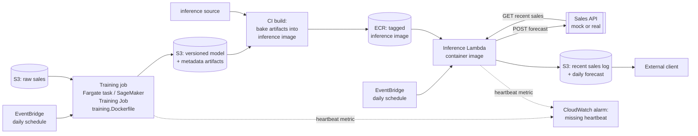

# Deployment (proposed)

This is the proposed AWS target — **not deployed**. Only the local pieces are actually
built: the container images and the Compose stack described in `docs/architecture.md`.
Everything below — the AWS services, the schedule, the read path — is a design, not a
running system. See `docs/what_if.md` for how this design changes further out as
requirements shift.

## Two schedules, two compute shapes

The split is by workload, not by platform:

- **Training** → a Fargate task or a SageMaker Training Job, not Lambda. Lambda's
  15-minute execution cap and 10 GB image/`/tmp` ceiling are fine against today's
  ~20k-row CSV but don't generalise, and Lambda has no GPU path if the model ever needs
  one. Training reads raw sales from S3 and writes the model + metadata back to S3 — the
  same two artifacts it already writes locally.
- **Daily inference batch** → a Lambda container image. The whole run is seconds of
  compute against a 2.5 MB model; at once-a-day cadence every invocation is a cold
  start anyway, so Lambda's cold-start tax buys nothing to optimise away, and its
  15-minute/10 GB ceiling is never in play at this size.

Both are the *same* container contract already proven by the local Compose stack:
training writes into a shared volume, inference reads it back. Swapping the runner from
Compose to Fargate/Lambda changes the trigger and artifact source, not the code inside
the image.

## Why Fargate/SageMaker + Lambda, not Databricks

Databricks is the closest managed alternative: native MLflow tracking + registry, Jobs
run-status alerting with no separate metrics system to build, and a notebook-to-
production story that would have matched this project's original Jupyter shape.

Declined for this design, not overlooked:

- More familiarity with AWS services — time didn't allow deeply exploring Databricks.
- Containers let dependencies get pinned exactly and a run reproduced on a laptop,
  which a managed notebook/cluster runtime doesn't give as directly. Databricks Jobs
  run against a cluster spec, not arbitrary containers — Container Services only
  customises the cluster's base image, not the plain `ENTRYPOINT` + config-file/env-var
  contract these images already use. Adopting Databricks now would mean re-deriving the
  training/inference split for its container model instead of reusing what already
  works.
- Lambda's per-invocation billing and Fargate's per-task-second billing are cheap at
  this job's actual size (one ~20k-row CSV, seconds of compute, once a day), with no
  cluster fleet to keep provisioned.
- What's given up: native MLflow registry — already a declined-for-now upgrade, see
  `docs/what_if.md` #4 — and Jobs run-status alerting, which the CloudWatch heartbeat
  alarm below covers for the same "job silently stopped" failure mode.

Revisit if retraining ever needs coordinating across multiple contributors, or
notebook-based experimentation becomes a real day-to-day workflow again.

## Model-loading strategy per platform

The image build already treats the model directory as a config value, not a hardcoded
path — `artifact_dir` is a plain field consumed by `verify_artifacts_present` and
`load_model` as a parameter, and any config field can be overridden from an env var. So
"where the model lives" is a deploy-time decision, not a code change. Two strategies
fall out of that:

- **Baked into the image** (today's default: the model is copied into `/opt/model` as
  the last Dockerfile layer). This is the Lambda path: no startup fetch, no dependency
  on S3 being reachable or the training job having finished before the schedule fires,
  and the image tag *is* the deployable unit.
- **Mounted or fetched at start** — point `artifact_dir` at a mounted volume, or have
  the entrypoint pull from S3 before startup checks run. Nothing in the model-loading
  code needs to change; this is the shape to reach for once baking stops making sense —
  see `docs/what_if.md` #3.

### Why baked, not fetched, by default

At daily cadence, cold starts are the normal case — there's no warm pool to keep hot for
a once-a-day invocation. Baking means the image is self-contained: no network call on
the critical path, no "S3 was slow/unreachable, fail the whole day's forecast" failure
mode, and the container fails at build time (missing artifact) rather than at
invocation time. The cost is coupling model and code releases together — accepted here
because a daily batch job has no user-facing deploy-window pressure; see
`docs/what_if.md` #3 for when that cost stops being acceptable.

### Rollback

Rollback is redeploying the previous image tag. Because the model is baked in, "roll
back the model" and "roll back the code" are the same action — no separate
model-registry rollback to coordinate. Once that coupling stops scaling,
`docs/what_if.md` #4 covers moving to DVC or MLflow to tag and roll back models
independently of code releases.

## Predictions store and the low-latency read path

Inference would write each day's forecast, plus the recent-sales window it pulled from
the sales API, to S3 under a dated key — the same artifact already produced locally,
just added as a second sink. This isn't built yet: `ForecastRecordStore`
(`inference/record_store.py`) only has a local implementation today; an S3 store is the
natural extension point once this is needed.

The requirement (`docs/task.md`) is that external clients can query predictions "at any
time with low latency." A direct read of a well-known, dated S3 key clears that bar at
this system's actual request volume — a handful of clients, one new object a day: GET
latency is tens of milliseconds and no compute sits on the read path. Access would be a
public-read bucket policy, justified by the data being non-PII aggregate sales figures;
a presigned-URL scheme is the fallback if public-read is rejected later.

Freshness — how soon after the daily trigger the forecast is available — is exactly
`inference_duration_seconds`, already recorded on every run (see Alerting, below). A
CloudWatch alarm on that metric exceeding a threshold would be the freshness-SLA alert,
using the same alarm mechanism as the heartbeat and drift checks.

This deliberately doesn't give clients filtered/indexed/paginated queries, per-client
auth, or write-concurrency protection — see `docs/what_if.md` #2 for that escalation
and its trigger.

## Failure signal: heartbeat, not just bad values

Both scheduled jobs already emit `total_duration_seconds` and `correlation_id` on every
run, whether or not the run recorded anything else. In AWS, the metrics sink behind
that becomes a CloudWatch implementation instead of today's logging one (same
interface, no caller change), and a CloudWatch alarm fires when that metric goes
*missing* within the expected window — catching a job that silently stopped firing at
all. A bad prediction still emits the heartbeat and passes this check; it's a liveness
check, not a quality check — see below for drift/quality monitoring.

## Drift and data-quality monitoring

Not implemented yet. There's no ground-truth/label feedback loop in this project, so
monitoring would be limited to data/feature drift (e.g. an unknown-category-rows count,
an outlier-bound-violation rate), not model performance — that needs predictions joined
against actuals, which persisting the recent-sales window to S3 (above) sets up for
later but doesn't provide today.

## Alerting

One mechanism would serve both the heartbeat and the drift metrics above: a CloudWatch
alarm per metric (missing-data alarm for the heartbeat, threshold alarms for drift),
each wired to an SNS topic fanning out to email/Slack subscribers. Nothing upstream of
the alarm needs to know this exists — it's a CloudWatch resource watching whatever the
metrics sink already sends.

## Secrets

The sales API token is already read from the environment at call time. In AWS the only
change is where that env var's value comes from — Secrets Manager injected into the
Lambda's environment at invoke time, rather than a Compose-level literal — not the code
that reads it.

## Infrastructure as code

Terraform, one parameterised root module rather than three separate configs —
dev/staging/prod are the same resource shape, differing only in IAM/GitHub-Environment
scoping. State backend: S3 with native locking.

**Enforcing pipeline-only writes:** three deploy roles (dev/staging/prod), each trusted
only via GitHub's OIDC provider — no IAM users, no long-lived AWS keys for a human. The
ECR repositories and the model-artifacts/predictions S3 buckets would each carry a
resource policy denying writes to everything except that environment's deploy-role ARN.

**Runtime execution roles** are separate from the deploy roles and scoped tighter: a
Fargate task role for training, a Lambda execution role for inference. Neither can
touch ECR, the other's bucket, or IAM itself.

**Pipeline wiring:** Terraform would create the EventBridge daily-schedule rules and
targets, the ECS task definition, and the Lambda function. Model promotion is
deliberately not fully automated end to end — training producing a new model doesn't by
itself put it in front of clients. Building the new artifact into an inference image
and pushing it to prod would ride the same human-gated path code deploys already use —
a manual `workflow_dispatch` + required reviewer on the `prod` GitHub Environment. A
person looks at the training run's validation metrics (`validation_mae`,
`validation_rmse`, `validation_wmape_percent`, already recorded — see Alerting, above)
and decides to trigger that promotion.

**Read-only human role:** a separate IAM role for people — describe/read-only
permissions on ECR, CloudWatch Logs, and alarms — for viewing and debugging only. It
cannot push an image, update the Lambda, or touch the ECS task definition.
