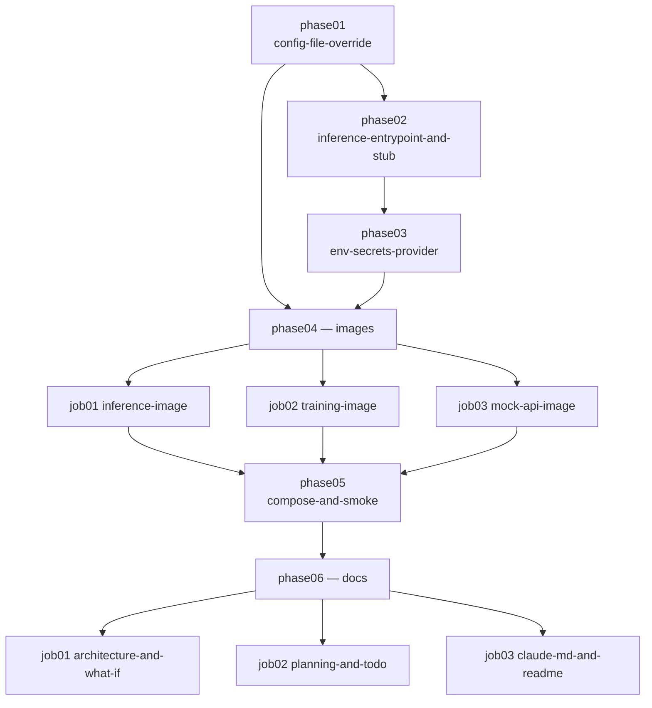

# docker-deploy — plan

Versionable red/green/refactor plan. One phase doc per step + a `prompt.md` runner.

## How to run
`/plan execute phase1` (one phase at a time). See `prompt.md` for the ceremony and guardrails.

## Why
`training` and `inference` are only runnable as `uv run python3 <script>` from the repo root.
`Makefile:78-79` states outright that no deploy infra exists, and `.github/workflows/ci-cd.yml`
calls `make deploy-*` stubs that just `echo`. This plan adds minimal, layer-cacheable images for
both apps plus a Compose stack that runs inference against a stubbed remote API — so the *real*
HTTP code path is exercised locally, which is `docs/planning.md:14`'s stated principle ("no
separate bogus local-only path").

Getting there requires removing the in-process simulation stub from production code and fixing two
things that make real mode unrunnable outside Databricks.

## Decisions taken
| Decision | Choice |
|---|---|
| Secrets | Env-var provider; **delete** `_DatabricksSecretsProvider`, keep the `SecretsProvider` seam |
| Simulation stub | Moves into `src/inference/tests/`, injected via the existing `SalesGateway` protocol |
| Model in inference image | Baked at `/opt/model` as the last layer, `INFERENCE_ARTIFACT_DIR`-overridable |
| Training image paths | Platform-neutral absolute paths, no SageMaker conventions |
| Mock API | stdlib `http.server`, zero dependencies, not a workspace member |
| Inference e2e | In-process `run()` **plus** a Compose smoke test |
| Deployment target | Split by workload: training → SageMaker/Fargate, daily inference → Lambda container |

## Why not bespoke
Industry-standard wherever it exists:
- **uv's own Docker pattern** (astral's `uv-docker-example`) for the two-stage
  `--no-install-workspace` → `--no-editable` sync split, rather than a hand-rolled layer scheme.
  It is the only way the dependency layer actually caches with a workspace-wide `uv.lock`.
- **Compose `depends_on` conditions** (`service_healthy`, `service_completed_successfully`) rather
  than a wait-for-it script.
- **Env-var-pointing-at-a-config-file** — the 12-factor shape that maps onto a k8s ConfigMap, an
  ECS EFS volume and a SageMaker S3 input channel unchanged, instead of a platform-specific loader.
- **The existing `SalesGateway` / `SecretsProvider` protocols** for injection; no new seam is
  invented, and `main()` already took its collaborators as parameters.

One bespoke choice, in **phase 04 job 03**: the mock API is ~80 lines of stdlib `http.server`
rather than WireMock, mockserver or FastAPI. WireMock cannot slice its response by `history_days`,
so the fixture would be a frozen blob that silently drifts from
`data/coffeeshop_daily_sales_report.csv` — the file the committed baseline is derived from. FastAPI
would add a dependency tree and a workspace member for two endpoints. The stdlib server reads the
same CSV the baseline came from and installs nothing.

## Assumptions
- `data/coffeeshop_daily_sales_report.csv` stays the single committed input; real deployments swap
  it for S3 without a code change.
- `StubSalesGateway` reproduces `_SimulatedGateway`'s payload exactly, so
  `src/inference/tests/baseline/inference_next_day_forecast.csv` does **not** need regenerating.
  If it drifts, the stub is wrong — fix the stub, never the baseline (`CLAUDE.md:60-66`).
- Docker and Compose are available locally (29.8.0 / 5.5.1 confirmed) and in CI.
- Python 3.14 slim base images exist for both the uv builder and the runtime stage.

## Phase order

Phases 01-03 are Python-only and keep the host test suite green throughout. Phase 04 adds files
without touching Python. Phase 05 is the first step that needs Docker to pass. Phase 06 is
docs-only and must run last, because it cites line numbers that phases 01-05 move.

## Phases
| id | title | goal |
|---|---|---|
| phase01 | config-file-override | `load_config` honours `<PREFIX>_CONFIG_FILE`, so the packaged `config.toml` can be replaced by a mount on any platform |
| phase02 | inference-entrypoint-and-stub | The simulated data source becomes a test fixture injected through `SalesGateway`; the inference e2e goes in-process via a new `run()` without losing mutation coverage |
| phase03 | env-secrets-provider | Inference can authenticate outside Databricks — the blocker stopping the Compose stack from running at all |
| phase04 | images | Three minimal, layer-cacheable images (inference, training, mock API), each buildable on its own |
| phase05 | compose-and-smoke | `docker compose up` trains, serves, infers and uploads over the real HTTP path; closes `docs/TODO.md:14` |
| phase06 | docs | Rationale docs match the code, the deployment decision is explicit, and the diagram + escalation path exist |

## Risk notes
- **Phase 02 is the highest-risk step.** Extracting `run()` is what keeps mutation 5 biting; calling
  `main()` directly from the new e2e would silently drop the artifact fail-fast check. The
  env-override route is *not* available in-process, because `CONFIG` is an import-time singleton
  already frozen by collection time — the fixture must construct a `Config` and pass it.
- **`init_context()` ordering** in `daily_product_demand_inference.py:15` sits between imports on
  purpose; moving it degrades `X-Correlation-ID` to `"-"`.
- **`libgomp1`** is required in any slim runtime stage importing xgboost.
- `make test-mutation` requires a clean working tree for the files it mutates.
