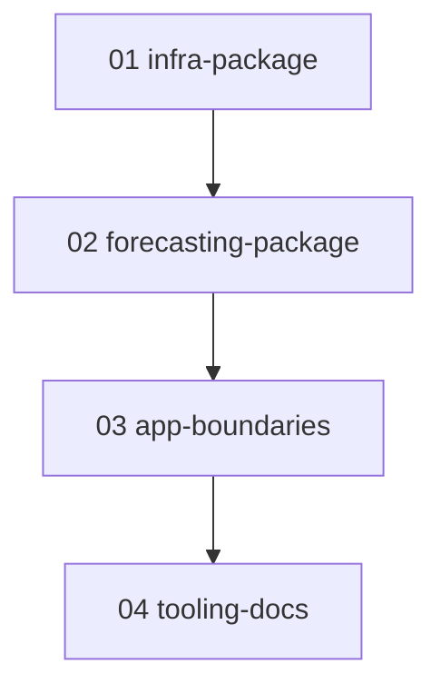

# package-split — plan

Versionable red/green/refactor plan. One phase doc per step + a `prompt.md` runner.

## How to run
`/plan execute phase1` (one phase at a time). See `prompt.md` for the ceremony and guardrails.

## Context
Today's layout is `training → common ← inference`. `common` is a mixed bag: cross-cutting infra
(config loader, logger, correlation context) next to domain code (column constants, feature
engineering, preprocessing, the train↔infer metadata contract). `inference` is likewise mixed —
the domain kernel (features, encoding, predict) sits beside the I/O of a pipeline runtime (HTTP
gateway, secrets, session, payload schemas, CSV write).

That split does not survive the DRY work already queued as P0 in `docs/TODO.md:11`. The one-hot +
reindex-to-contract block exists **three** times (`training:229-235`, `training:349-352`,
`inference/features.py:42-47`); the future-placeholder-row block twice; the clip+round predict
twice; the date×category panel build twice. Both `docs/TODO.md` and `docs/planning.md` currently
prescribe "extract into `common`", which would only make the junk drawer bigger.

Target — a libs/apps shape, two libraries and two deployable apps, neither app depending on the
other:

```
src/
  infra/        load_config, find_project_root, get_logger, CORRELATION_ID, init_context
  forecasting/  consts, metadata contract, preprocessing, features, model load + predict, artifacts
  training/     app: load CSV, clean, IQR bounds, fit, evaluate, write artifacts
  inference/    app: gateway, http session, payload schemas, pipeline entrypoint
  testkit/      dev-only, unchanged

training  ─┐
           ├─→ forecasting ─→ infra
inference ─┘
```

**Scope: package structure only.** Training stays a flat module-level script; its reuse sites get
TODO comments naming the `forecasting` functions that will absorb them. No training logic moves
and no duplication is collapsed here — that is a follow-up plan.

`.github/workflows/ci-cd.yml` (lint → test-unit → test-e2e → gated deploy) merged after this plan
was drafted. It calls only `make lint`/`test-unit`/`test-e2e`/`sync`, none of which name a
package path — confirmed via `grep -n common Makefile .github/workflows/ci-cd.yml` returning
nothing — so no phase needs CI changes. Every phase's `make test` green requirement is what keeps
that pipeline green too.

**Hard invariant: every e2e baseline stays byte-identical.** These are file moves and import
rewrites, nothing else. A baseline that shifts means a mistake was made, not that a baseline needs
refreshing. No phase may run `make baseline-inference` or copy anything into a `tests/baseline/`
directory.

## Why these steps (and why not bespoke)
The layout follows the standard monorepo **libs/apps** convention — shared code that is never
deployed alone in libraries, deployable units in apps, dependencies pointing only inward
(Tweag's Python monorepo write-up; the same `apps/` + `libs/` split is the common
recommendation). `forecasting` as a domain core free of HTTP, secrets and registries is
ports-and-adapters applied to a batch pipeline; the existing `SalesGateway` Protocol is already
the port, so this is naming the pattern the code has rather than importing a new one.

Nothing bespoke is introduced. Standard tooling does the work: `uv` workspace members express the
boundary and enforce it at sync time (`make sync-inference --no-dev` cannot resolve an app that
reaches across), `git mv` keeps history, and the existing `scripts/mutation_check.sh` proves the
suites still bite after the move. The alternative single-package layout (cookiecutter-data-science
`src/{data,features,models}`) was rejected because it cannot express the deploy subset, which is
the whole reason this workspace exists.

`infra` is kept separate from `forecasting` rather than folded in — strict YAGNI would merge them
(nothing today needs infra without domain), but the separation is what lets the kernel be stated
as depending on nothing but pandas/xgboost/pydantic plus a logger, and it stops `common`'s
junk-drawer failure mode from recurring under a new name.

## Phases


Sequential, no parallel jobs: phases 01 and 02 both rewrite imports repo-wide, so worktree
isolation would collide.

| id | title | goal |
|---|---|---|
| phase01 | infra-package | Extract config/logger/context into a new `infra` member; `common` is left holding domain code only. |
| phase02 | forecasting-package | Fold the rest of `common` plus `inference`'s pure-compute modules into a `forecasting` kernel; `src/common/` disappears. |
| phase03 | app-boundaries | Make each member declare exactly what it imports; mark every training site the kernel will absorb later. |
| phase04 | tooling-docs | Retarget `scripts/mutation_check.sh`, `CLAUDE.md`, `docs/TODO.md` and `docs/planning.md`; close the two backlog items this answers. |
