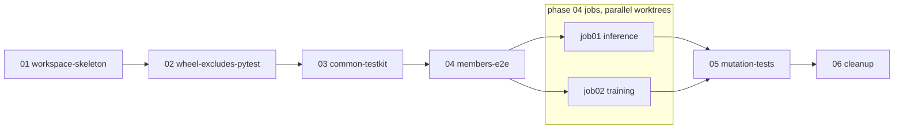

# uv-workspace — plan

Versionable red/green/refactor plan. One phase doc per step + a `prompt.md` runner.

## How to run
`/md-plan execute phase1` (one phase at a time). See `prompt.md` for the ceremony and guardrails.

## Context
Code lives in `src/` but as one flat uv project. Inference support modules and notebook sit in
`src/inference/`, `src/common/` holds `consts.py` + `features.py`, the training notebook is loose at
`src/daily_product_demand_forecast.ipynb`. Imports only work through Jupyter's cwd-on-`sys.path`
plus an explicit `sys.path.insert(0, "..")` hack. `tests/regression/` runs both notebooks via
nbclient, copies `src/common` into a tmp mirror, and chains inference on training.

Goal: `inference -> common <- training`, deployable as `inference+common` or `training+common` with
uv alone. **Structure only** — notebooks move and get package-qualified imports; they remain the
executables. Notebook -> `.py` conversion is a later plan.

## Decisions (final)
- uv **workspace**: members `src/*`, one `uv.lock`, virtual root (`[tool.uv] package = false`).
- Dist name == import name: `common`, `inference`, `training`, plus dev-only `testkit` (shared test
  helpers; reached through `[dependency-groups] dev`, so `--no-dev` drops it).
- `common` = feature extraction + config loader + logger + context. `http_session` stays in `inference`.
- e2e tests in `src/<member>/tests/` (sibling of the package, never in a wheel). Inference e2e is
  standalone on committed baseline artifacts.
- Unit tests `<module>_test.py` beside code, excluded from wheels via `wheel-exclude`.
- `data_dir` / `artifact_dir` / `output_dir` config-driven (member TOML + `<MEMBER>_*` env override).
- **Notebook edits are minimal**: only import lines and the `*_DIR` assignment cells. Nothing else.
- **Mutation phase** proves every e2e suite fails when what it guards is broken.

## Why these steps (and why not bespoke)
- **uv workspace** over a single project + extras: the only standard way to make `uv sync
  --package inference --no-dev` install exactly `inference + common`. Extras would need a
  hand-rolled directory filter and would not stop `inference` importing `training`.
- **`uv_build` + `wheel-exclude`** over a deploy-time file filter: exclusion lives in build config
  where any packaging tool honours it.
- **pytest `python_files`** over renaming tests: `*_test.py` beside code is a supported pytest
  convention, one config line.
- **Bespoke: `scripts/mutation_check.sh`** (phase 05). `mutmut`/`cosmic-ray` mutate every
  statement and rerun the suite per mutant — hours for nbclient-driven e2e runs. Six hand-picked
  mutations targeting the exact invariants (feature code, baselines, artifact presence, config)
  give the same proof in minutes. Kept to one shell function + a table.

## Phase order


## Phases
| id | title | goal |
|---|---|---|
| phase01 | workspace-skeleton | `uv sync --package inference --no-dev` installs only inference+common; old suite green |
| phase02 | wheel-excludes-pytest | `*_test.py` never in wheels; pytest discovers them |
| phase03 | common-testkit | `common` config loader/logger/context; `testkit` runner + asserts |
| phase04 | members-e2e | each member's e2e runs standalone from `src/<member>/tests/` (2 parallel jobs) |
| phase05 | mutation-tests | `make test-mutation` proves e2e suites catch breakage |
| phase06 | cleanup | legacy `tests/` gone; Makefile covers dev / per-member / deploy-subset |

## Target layout
```
pyproject.toml            # workspace root, virtual; dev deps, ruff, pytest config
uv.lock
data/  outputs/           # unchanged
scripts/mutation_check.sh
src/
  common/    pyproject.toml  common/{__init__,config,config_test,logger,context,consts,features}.py  tests/
  inference/ pyproject.toml  inference/{__init__,config,config_test,http_session}.py config.toml *.ipynb
             tests/{conftest.py,test_inference_notebook.py,baseline/{xgb_daily_product_demand.json,forecast_metadata.joblib,inference_next_day_forecast.csv}}
  training/  pyproject.toml  training/{__init__,config}.py config.toml *.ipynb
             tests/{conftest.py,test_training_notebook.py,baseline/{forecast_metadata.joblib,next_day_product_forecast.csv}}
  testkit/   pyproject.toml  testkit/{__init__,notebooks,asserts}.py  README.md
```

## Verified facts
- uv 0.12.15; `uv_build` supports `module-root`, `wheel-exclude`, `source-exclude`.
- `members = ["src/*"]` requires a `pyproject.toml` in every `src/*` dir.
- `tests/regression/baseline/` lacks `xgb_daily_product_demand.json` — generated in phase 04.
- `http_session.py` needs `requests` declared (currently transitive via jupyter).
- Jupyter kernel cwd = notebook dir; cwd-walking for `data/`/`outputs/` dies on move.

## Risks
- `wheel-exclude` glob anchoring undocumented offline — phase 02 gates it empirically.
- `uv run --package X` dev-group behaviour — phase 04 has a `--no-sync` fallback.
- `--import-mode=importlib`: test modules can't import each other by bare name; go through `testkit`.
